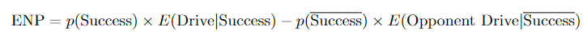

```{r setup, include=FALSE}
knitr::opts_chunk$set(echo = TRUE)
knitr::opts_chunk$set(message = FALSE)
knitr::opts_chunk$set(warning = FALSE)
knitr::opts_chunk$set(cache = TRUE)
# knitr::opts_chunk$set(cache.lazy = FALSE)
```

# Intro

## Business Problem

The purpose of this analysis is to provide football coaches, players, and fans with information and insight into the appropriate decision making that goes into a 4th down. We want to provide a model that provides a recommendation and valuable insight into whether or not it is worth it to attempt a 4th down conversion. This problem is significant and important because 4th downs are a crucial part of any football game. Correctly deciding what approach to do can change the course of the game, and this is especially important when every point matters. By maximizing the expected points and win probability that comes with each decision, our audience can better understand the game of football and make these otherwise difficult judgement calls that have historically been made on instinct. 

For example, on Sunday, December 5 Head Coach of the Detroit Lions Dan Campbell decided to go for it on 4th and 1 on his own 28 yard line at a pivotal moment of the game. His decision ended up being costly. We want to be able to input pre-snap information that will give us valuable insight into what is the correct decision.

## Dataset Information

### Data Summary

We are using the detailed NFL Play-by-Play Data from 2010-2020 (this may be expanded into seasons pre-2010 if we either want more data, or want to test our model on additional seasons) . We initially found [this](https://www.kaggle.com/maxhorowitz/nflplaybyplay2009to2016) dataset on Kaggle. The data was scraped from NFL data by Carnegie Mellon researchers from NFL databases. The source dataset is too large to keep in the git repository so we had to use [this](https://www.nflfastr.com/) R package `nflfastR` (same data source as the Kaggle dataset) to extract data.

### Data Structure

The data has 531,515 rows and 372 variables. Variable descriptions and dataset information can be found [here](https://www.nflfastr.com/articles/field_descriptions.html). Many of the variables in the dataset include information about the play itself, after the decision to go for it was made, and thus we will not include these variables in our prediction. 

### Response Value

We will evaluate one choice for a given team: attempt to convert a fourth down, or do not. 

*Fourth Down Expected Net Points:* The probability that the fourth down conversion will be successful, multiplied by the expected outcome of the remainder of the drive upon success, minus the probability that the fourth down conversion will not be successful times the expected outcome of the opponent’s drive starting from the spot of the turnover. In other words, Expected Net Points (ENP) comes from the following formula:



We will predict the probability of a successful conversion by using logistic regressions, machine learning algorithms, and stacked models. The expected points response is found by using an already created model that uses a decision tree stacked model trained with xgboost. It has been pre-trained by the creators of the nflfastR library. More info [here](https://www.opensourcefootball.com/posts/2020-09-28-nflfastr-ep-wp-and-cp-models/). 

## Challenges with Dataset

With a dataset of this magnitude and complexity there are many technical issues that we have run into. To start, we had trouble finding the adequate dataset as the NFL does not provide play-by-play data explicitly. Instead, third-parties have used web-scraping to extract the data and provide it to us. In doing so we had to be careful in what dataset we selected.

After choosing a dataset we also have to understand the dataset and decide what is relevant and what variables can actually be used in our prediction. Many variables are already predictions from the variables within the same dataset and we need to ensure we are not using any of these variables in predictions. There is also many “post-play” information variables that we cannot use in our prediction. We only want to use variables that are known and easily accessible for a coach to make a decision before the play.

In addition, one challenge we may face is the time period we choose to use. We currently plan on analyzing NFL statistics from 2010-2020, but we could also consider all data from 2000-2020. Our current understanding is that NFL gameplay strategy has evolved since the early 2000s, and looking at data that is earlier than the most recent decade may incorporate gameplay statistics that are irrelevant and outdated to current gameplay. After this initial analysis, we ideally would like to take a broader look at these statistics.

# Setup

## Load Packages
```{r, cache=FALSE}
library(C50)
library(caret)
library(class)
library(janitor)
library(kernlab)
library(neuralnet)
library(nflfastR)
library(stats)
library(tidyverse)
library(rmarkdown)
```

## Load Data

We will load the full 2010-2020 play-by-play data below:

<input type=button class=hideshow></input>

```{r}
future::plan("multisession")
pbp <- load_pbp(2010:2020, file_type = "qs")
str(pbp)
```

## Set up "Going For It" (GFI) Data

We are filtering the full play-by-play data from 2010-2020 to only include plays that are fourth down attempts. 
```{r}
# Only pull plays that are a fourth down attempt
GFI <- pbp[!is.na(pbp$play_type), ]
GFI <- GFI[!is.na(GFI$play_id) & GFI$down == 4 & GFI$punt_attempt == 0 & GFI$field_goal_attempt == 0 & GFI$play_type != "no_play" & GFI$play_type != "qb_kneel", ]
```

```{r}
# Using model.matrix to convert all the factors to dummy variables
# We are converting all of the factors into dummy variables as the input into knn has to be numeric

# Include all variables for step function, exclude NA rows
GFI_ALL <- GFI[!is.na(GFI$fourth_down_converted), ]

## Randomize the rows in the data (shuffling the rows)
set.seed(123)
GFI_ALL <- slice(GFI_ALL, sample(1:n()))
```


# Variable Selection with GLM

In order to expedite training our models, we want to pick only variables that may be significant. We decided to use backwards stepwise logistic regression to identify significant variables.

## Training

First we filtered the full play by play data to only include "pre-snap" data, or data that is known before a play starts, since this is the only data we should take into account when predicting if a fourth down conversion will be succesful. 

<input type=button class=hideshow></input>

```{r}
GFI_GLM_ALL <- select(
  GFI_ALL,
  fourth_down_converted,
  season_type,
  week,
  posteam_type,
  yardline_100,
  quarter_seconds_remaining,
  half_seconds_remaining,
  game_seconds_remaining,
  game_half,
  qtr,
  goal_to_go,
  ydstogo,
  play_type,
  shotgun,
  no_huddle,
  home_timeouts_remaining,
  away_timeouts_remaining,
  timeout,
  posteam_timeouts_remaining,
  defteam_timeouts_remaining,
  posteam_score,
  defteam_score,
  score_differential,
  special_teams_play,
  fixed_drive,
  away_score,
  home_score,
  location,
  div_game,
  roof,
  surface,
  home_opening_kickoff
)
GFI_GLM_ALL <- GFI_GLM_ALL %>% mutate_if(is.character, as.factor)

GFI_GLM_ALL <- GFI_GLM_ALL %>% select(where(~ n_distinct(.) > 1))

train_set <- sample(1:nrow(GFI_GLM_ALL), 0.7 * nrow(GFI_GLM_ALL))


# Training set
gfi_glm_train <- GFI_GLM_ALL[train_set, ]
gfi_glm_validation <- GFI_GLM_ALL[-train_set, ]

model_glm <- glm(fourth_down_converted ~ ., data = gfi_glm_train, family = "binomial", control = list(maxit = 100))
model_glm <- step(model_glm, direction = "backward", trace = 0)
summary(model_glm)
```

## Predicting

In the process of selecting these variables, we predicted fourth down conversion success for a validation set to use as a baseline for future predictive models.

<input type=button class=hideshow></input>

```{r}
predict_glm <- predict(model_glm, newdata = gfi_glm_validation, type = "response")
predict_glm_factor <- ifelse(predict_glm < 0.5, 0, 1)
predict_glm_factor <- as.factor(predict_glm_factor)
confusionMatrix(predict_glm_factor, as.factor(gfi_glm_validation$fourth_down_converted))
```

Now we will run future models on just inputs the stepwise GLM found significant.

```{r}
# Include only variables we want to use in prediction
GFI_small <- select(
  GFI_ALL,
  fourth_down_converted,
  yardline_100,
  half_seconds_remaining,
  game_half,
  goal_to_go,
  ydstogo,
  play_type,
  shotgun,
  timeout,
  posteam_score,
  defteam_score,
  away_score,
  home_score
)

GFI_small <- GFI_small %>% mutate_if(is.character, as.factor)

GFI_small <- GFI_small %>% select(where(~ n_distinct(.) > 1))

GFI_small <- clean_names(GFI_small)

# Model Matrix for ANN
GFI_mm <- as.data.frame(model.matrix(~ . - 1, GFI_small))


# Normalize the data
normalize <- function(x) {
  return((x - min(x)) / (max(x) - min(x)))
}

# we are going to normalize everything
# Create Labels for KNN
GFI_norm <- as.data.frame(lapply(GFI_mm[-1], normalize))
GFI_labels <- GFI_mm[, 1]
```

# Individual Models

We will now build the following models to predict fourth down conversion success:

- Logistic Regression
- Artificial Neural Network
- k-Nearest Neighbors
- Support Vector Machine
- Decision Tree

## Logistic Regresion

### Training

<input type=button class=hideshow></input>
```{r}
model_glm <- glm(fourth_down_converted ~ ., data = GFI_small, family = "binomial", control = list(maxit = 100))
summary(model_glm)
```

### Predicting

<input type=button class=hideshow></input>
```{r}
predict_glm <- predict(model_glm, newdata = GFI_small, type = "response")
predict_glm_factor <- ifelse(predict_glm < 0.5, 0, 1)
predict_glm_factor <- as.factor(predict_glm_factor)
glmcm <- confusionMatrix(predict_glm_factor, as.factor(GFI_small$fourth_down_converted))
glmcm
```

## ANN

### Training

We built an ANN with one hidden layer with 3 nodes. Given a more powerful neural network package we would have built a deeper network, but the `neuralnet` package takes too long to train. 

<input type=button class=hideshow></input>
```{r}
model_ann <- neuralnet(fourth_down_converted ~ ., data = GFI_mm, stepmax = 1000000, hidden = 3)
plot(model_ann)
```


### Predicting

<input type=button class=hideshow></input>

```{r}
predict_ann <- neuralnet::compute(model_ann, GFI_mm)
predict_ann <- predict_ann$net.result
predict_ann_factor <- ifelse(predict_ann < 0.5, 0, 1)
predict_ann_factor <- as.factor(predict_ann_factor)

anncm <- confusionMatrix(predict_ann_factor, as.factor(GFI_mm$fourth_down_converted))
anncm
```


## KNN

### Tuning the hyperparameter k

We wrote a brief for-loop to tune the hyperparameter k for the k-nearest neighbors model. We chose Kappa as the decision metric we were optimizing for.

<input type=button class=hideshow></input>

```{r}

best_kappa <- 0
best_k <- 0

train_set <- sample(1:nrow(GFI_norm), 0.7 * nrow(GFI_norm))

# Training set
gfi_knn_train <- GFI_norm[train_set, ]
gfi_knn_validation <- GFI_norm[-train_set, ]

gfi_knn_train_labels <- GFI_labels[train_set]
gfi_knn_validation_labels <- GFI_labels[-train_set]

for (i in 1:100) {
  knn_pred <- knn(
    train = gfi_knn_train, test = gfi_knn_validation,
    cl = gfi_knn_train_labels, k = i
  )

  kappa <- confusionMatrix(as.factor(knn_pred), as.factor(gfi_knn_validation_labels))$overall["Kappa"]

  if (kappa > best_kappa) {
    best_k <- i
    best_kappa <- kappa
  }
}
```

### Training & Predicting

Once we determined the k hyperparameter that maximizes Kappa, we trained our kNN model with that value of k and predicted the data.

<input type=button class=hideshow></input>

```{r}

knn_pred <- knn(
  train = GFI_norm, test = GFI_norm,
  cl = GFI_labels, k = best_k
)

knncm <- confusionMatrix(as.factor(knn_pred), as.factor(GFI_labels))
knncm
```

## SVM

### Tuning the hyperparemeter sigma

We wrote a brief for-loop to tune the hyperparameter sigma for the SVM model. We chose Kappa as the decision metric we were optimizing for.

<input type=button class=hideshow></input>

```{r}
best_kappa <- 0
best_sigma <- 0

train_set <- sample(1:nrow(GFI_small), 0.7 * nrow(GFI_small))

# Training set
gfi_svm_train <- GFI_small[train_set, ]
gfi_svm_validation <- GFI_small[-train_set, ]

for (i in c(2:10 %o% 10^(-5:1))) {
  model_svm <- ksvm(fourth_down_converted ~ ., data = gfi_svm_train, kernel = "rbfdot", kpar = list(sigma = i))
  predict_svm <- predict(model_svm, gfi_svm_validation)
  predict_svm <- ifelse(predict_svm < 0.5, 0, 1)

  kappa <- confusionMatrix(as.factor(predict_svm), as.factor(gfi_svm_validation$fourth_down_converted))$overall["Kappa"]

  if (kappa > best_kappa) {
    best_sigma <- i
    best_kappa <- kappa
  }
}
```

### Training

Once we determined the sigma hyperparameter that maximizes Kappa, we trained our SVM and predicted the data.

<input type=button class=hideshow></input>

```{r}
model_svm <- ksvm(fourth_down_converted ~ ., data = GFI_small, kernel = "rbfdot", kpar = list(sigma = best_sigma))
```

### Predicting
```{r}
predict_svm <- predict(model_svm, GFI_small)
predict_svm <- ifelse(predict_svm < 0.5, 0, 1)

svmcm <- confusionMatrix(as.factor(predict_svm), as.factor(GFI_labels))
svmcm
```

## Decision Tree


### Training

<input type=button class=hideshow></input>

```{r}

model_tree <- C5.0(as.factor(fourth_down_converted) ~ ., data = GFI_small)
summary(model_tree)
```

### Predicting
```{r}
predict_tree <- predict(model_tree, GFI_small)

treecm <- confusionMatrix(predict_tree, as.factor(GFI_labels))
treecm
```


## Individual Model Performance

Kappa for each model is as follows:

- Logistic Regression: `r glmcm$overall["Kappa"]`
- KNN: `r knncm$overall["Kappa"]`
- ANN: `r anncm$overall["Kappa"]`
- SVM: `r svmcm$overall["Kappa"]`
- Decision Tree: `r treecm$overall["Kappa"]`

All of the models are reasonably accurate and provide valuable insight with varying levels of interpretability. The most accurate model is the SVM, with Kappa of `r svmcm$overall["Kappa"]` and Accuracy of `r svmcm$overall["Accuracy"]`. One difficulty in predicting fourth down conversion success will inevitably be the capabilities of individual players on both teams, which our model has no mechanism to incorporate, so we believe given the limited data this is quite accurate.


# Stacked Model

We will now combine each of the five individual models' predictions into a single data frame and use that to train a second level decision tree.

## Data Frame of all Predictions
```{r}
predictions <- as.data.frame(GFI_labels)
predictions$glm <- predict_glm
predictions$knn <- knn_pred
predictions$ann <- predict_ann
predictions$svm <- as.numeric(predict_svm)
predictions$tree <- predict_tree

str(predictions)
summary(predictions)
```

## Split into Train and Validation Sets

```{r}
set.seed(123)
train_set <- sample(1:nrow(predictions), 0.7 * nrow(predictions))

# Training set
train_data <- predictions[train_set, ]
str(train_data)

val_data <- predictions[-train_set, ]
str(val_data)
```

## Decision Tree
```{r}

set.seed(123)

second_level_tree <- C5.0(as.factor(GFI_labels) ~ ., data = train_data)
summary(second_level_tree)
```

## Validate Decision Tree

<input type=button class=hideshow></input>

```{r}
predict_second_level <- predict(second_level_tree, val_data)

plot(second_level_tree)

second_level_cm <- confusionMatrix(predict_second_level, as.factor(val_data$GFI_labels))
second_level_cm
```

As illustrated in the confusion matrix above, our second-level Stacked Model only branches on the SVM's prediction. This could be due to limited information gain by any of the other models. The second-level model has an accuracy of `r second_level_cm$overall["Accuracy"]` and a Kappa of `r second_level_cm$overall["Kappa"]`, which is the same performance as the SVM. 

# Decision Predictions

(Jim Harbaugh and Dan Campbell please read this part)

We will now create a function that uses the trained model to determine if a team should "Go For It" on 4th Down.

## Stacked Logistic Model
First, we want a stacked model that outputs a probability, and not a binary response. We will use a logistic stacked model instead of a decision tree. KNN will not be used because it is hard to form a lightweight function.

### Training

We will train our logistic regression model on the data output by our ANN, decision tree, logistic regression, and SVM models from before. We will use backward stepwise logistic regression to train.

```{r, cache=TRUE}
stacked_glm <- glm(GFI_labels ~ . - knn, data = train_data)
stacked_glm <- step(stacked_glm, direction = "backward")
summary(stacked_glm)
```

According to the stepwise training, the ann is also not that useful, so it can be omitted from the function we create too.

## Decision Function

Now we will define the actual decision function. The function requires as input a data frame with the following fields:

`yardline_100`, `half_seconds_remaining`, `game_half`, `goal_to_go`, `ydstogo`, `play_type`, `shotgun`, `timeout`, `posteam_score`, `defteam_score`, `away_score`, `home_score`, `season`, `home_team`, `posteam`, `roof`, `down`, `posteam_timeouts_remaining`, `defteam_timeouts_remaining`

It requires the following models passed in as inputs:

- SVM (`svm_model`)
- First-Level Logistic Regression (`glm_model`)
- Decision Tree (`tree_model`)
- Second-Level Logistic Regression (`stacked_glm`)

The function also takes a string `oppteam`, the abbreviation of the opposing team. 

The function is defined below:

```{r}
gfi <- function(df, stacked_glm, svm_model, tree, glm_model, oppteam) {
  df$game_half <- factor(df$game_half, levels(GFI_small$game_half))
  df$play_type <- factor(df$play_type, levels(GFI_small$play_type))

  model_outs <- data.frame(
    "glm" = predict(glm_model, newdata = df),
    "svm" = predict(svm_model, df),
    "tree" = predict(tree, df)
  )

  glm_logit <- predict(stacked_glm, model_outs)

  logit2prob <- function(logit) {
    odds <- exp(logit)
    prob <- odds / (1 + odds)
    return(prob)
  }

  prob_success <- logit2prob(glm_logit)

  pos_df <- df
  pos_df$down <- 1
  pos_df$ydstogo <- 10
  pos_df$yardline_100 <- pos_df$yardline_100 - pos_df$ydstogo

  success <- nflfastR::calculate_expected_points(pos_df) %>%
    dplyr::select(ep)

  opp_df <- df
  opp_df$posteam <- oppteam
  opp_df$down <- 1
  opp_df$ydstogo <- 10
  opp_df$yardline_100 <- 100 - pos_df$yardline_100

  failure <- nflfastR::calculate_expected_points(opp_df) %>%
    dplyr::select(ep)

  exp_net_pts <- prob_success * success$ep + (1 - prob_success) * failure$ep * -1

  tab <- data.frame(
    "Go For It?" = ifelse(exp_net_pts > 0, "Go For It", "Don't Go For It")
  )
  tab$`Probability of Success` <- prob_success
  tab$`Exp Points if Success` <- success$ep
  tab$`Exp Points if Fail` <- failure$ep
  tab$`Exp Net Points` <- exp_net_pts
  return(tab)
}
```

## Scenarios

Now that the function has been defined we will create a variety of scenarios and apply the function to them. We created a base scenario where the Detroit Lions are the home team with possession of the ball, on the 10 yard line to get to the opponent's end zone, 2 min left in the first half, running the ball. Detroit is up 21 to 3, playing the Chicago Bears in 2018. They are not in a shotgun formation, it is the third down, with 2 timeouts remaining for both teams. There are 5 yards to get the first down. For this scenario, our model predicted to go for it. 


```{r, cache=FALSE}
input_1 <- data.frame(
  "yardline_100" = 10,
  "half_seconds_remaining" = 120,
  "game_half" = "Half1",
  "goal_to_go" = 0,
  "ydstogo" = 5,
  "play_type" = "run",
  "shotgun" = 0,
  "timeout" = 0,
  "posteam_score" = 21,
  "defteam_score" = 3,
  "away_score" = 3,
  "home_score" = 21,
  "season" = 2018,
  "home_team" = "DET",
  "posteam" = "DET",
  "roof" = "dome",
  "down" = 4,
  "posteam_timeouts_remaining" = 2,
  "defteam_timeouts_remaining" = 2
)

input_2 <- data.frame(
  "yardline_100" = 50,
  "half_seconds_remaining" = 120,
  "game_half" = "Half1",
  "goal_to_go" = 0,
  "ydstogo" = 5,
  "play_type" = "run",
  "shotgun" = 0,
  "timeout" = 0,
  "posteam_score" = 21,
  "defteam_score" = 3,
  "away_score" = 3,
  "home_score" = 21,
  "season" = 2018,
  "home_team" = "DET",
  "posteam" = "DET",
  "roof" = "dome",
  "down" = 4,
  "posteam_timeouts_remaining" = 2,
  "defteam_timeouts_remaining" = 2
)

input_3 <- data.frame(
  "yardline_100" = 80,
  "half_seconds_remaining" = 120,
  "game_half" = "Half1",
  "goal_to_go" = 0,
  "ydstogo" = 5,
  "play_type" = "run",
  "shotgun" = 0,
  "timeout" = 0,
  "posteam_score" = 21,
  "defteam_score" = 3,
  "away_score" = 3,
  "home_score" = 21,
  "season" = 2018,
  "home_team" = "DET",
  "posteam" = "DET",
  "roof" = "dome",
  "down" = 4,
  "posteam_timeouts_remaining" = 2,
  "defteam_timeouts_remaining" = 2
)

input_4 <- data.frame(
  "yardline_100" = 10,
  "half_seconds_remaining" = 120,
  "game_half" = "Half1",
  "goal_to_go" = 0,
  "ydstogo" = 5,
  "play_type" = "run",
  "shotgun" = 0,
  "timeout" = 0,
  "posteam_score" = 14,
  "defteam_score" = 14,
  "away_score" = 14,
  "home_score" = 14,
  "season" = 2018,
  "home_team" = "DET",
  "posteam" = "DET",
  "roof" = "dome",
  "down" = 4,
  "posteam_timeouts_remaining" = 2,
  "defteam_timeouts_remaining" = 2
)

input_5 <- data.frame(
  "yardline_100" = 50,
  "half_seconds_remaining" = 120,
  "game_half" = "Half1",
  "goal_to_go" = 0,
  "ydstogo" = 5,
  "play_type" = "run",
  "shotgun" = 0,
  "timeout" = 0,
  "posteam_score" = 14,
  "defteam_score" = 14,
  "away_score" = 14,
  "home_score" = 14,
  "season" = 2018,
  "home_team" = "DET",
  "posteam" = "DET",
  "roof" = "dome",
  "down" = 4,
  "posteam_timeouts_remaining" = 2,
  "defteam_timeouts_remaining" = 2
)

input_6 <- data.frame(
  "yardline_100" = 10,
  "half_seconds_remaining" = 120,
  "game_half" = "Half1",
  "goal_to_go" = 0,
  "ydstogo" = 5,
  "play_type" = "run",
  "shotgun" = 0,
  "timeout" = 0,
  "posteam_score" = 21,
  "defteam_score" = 27,
  "away_score" = 27,
  "home_score" = 21,
  "season" = 2018,
  "home_team" = "DET",
  "posteam" = "DET",
  "roof" = "dome",
  "down" = 4,
  "posteam_timeouts_remaining" = 2,
  "defteam_timeouts_remaining" = 2
)

input_7 <- data.frame(
  "yardline_100" = 10,
  "half_seconds_remaining" = 120,
  "game_half" = "Half1",
  "goal_to_go" = 0,
  "ydstogo" = 5,
  "play_type" = "run",
  "shotgun" = 0,
  "timeout" = 0,
  "posteam_score" = 21,
  "defteam_score" = 3,
  "away_score" = 3,
  "home_score" = 21,
  "season" = 2018,
  "home_team" = "DET",
  "posteam" = "DET",
  "roof" = "dome",
  "down" = 4,
  "posteam_timeouts_remaining" = 1,
  "defteam_timeouts_remaining" = 2
)

input_8 <- data.frame(
  "yardline_100" = 10,
  "half_seconds_remaining" = 120,
  "game_half" = "Half1",
  "goal_to_go" = 0,
  "ydstogo" = 5,
  "play_type" = "run",
  "shotgun" = 0,
  "timeout" = 0,
  "posteam_score" = 21,
  "defteam_score" = 3,
  "away_score" = 3,
  "home_score" = 21,
  "season" = 2018,
  "home_team" = "DET",
  "posteam" = "DET",
  "roof" = "dome",
  "down" = 4,
  "posteam_timeouts_remaining" = 3,
  "defteam_timeouts_remaining" = 2
)

input_9 <- data.frame(
  "yardline_100" = 10,
  "half_seconds_remaining" = 120,
  "game_half" = "Half1",
  "goal_to_go" = 0,
  "ydstogo" = 5,
  "play_type" = "run",
  "shotgun" = 0,
  "timeout" = 0,
  "posteam_score" = 21,
  "defteam_score" = 3,
  "away_score" = 3,
  "home_score" = 21,
  "season" = 2018,
  "home_team" = "DET",
  "posteam" = "DET",
  "roof" = "dome",
  "down" = 4,
  "posteam_timeouts_remaining" = 0,
  "defteam_timeouts_remaining" = 2
)

input_10 <- data.frame(
  "yardline_100" = 10,
  "half_seconds_remaining" = 120,
  "game_half" = "Half1",
  "goal_to_go" = 0,
  "ydstogo" = 5,
  "play_type" = "run",
  "shotgun" = 0,
  "timeout" = 0,
  "posteam_score" = 21,
  "defteam_score" = 3,
  "away_score" = 3,
  "home_score" = 21,
  "season" = 2018,
  "home_team" = "DET",
  "posteam" = "DET",
  "roof" = "dome",
  "down" = 4,
  "posteam_timeouts_remaining" = 2,
  "defteam_timeouts_remaining" = 1
)

input_11 <- data.frame(
  "yardline_100" = 10,
  "half_seconds_remaining" = 120,
  "game_half" = "Half1",
  "goal_to_go" = 0,
  "ydstogo" = 5,
  "play_type" = "run",
  "shotgun" = 0,
  "timeout" = 0,
  "posteam_score" = 21,
  "defteam_score" = 3,
  "away_score" = 3,
  "home_score" = 21,
  "season" = 2018,
  "home_team" = "DET",
  "posteam" = "DET",
  "roof" = "dome",
  "down" = 4,
  "posteam_timeouts_remaining" = 2,
  "defteam_timeouts_remaining" = 3
)

input_12 <- data.frame(
  "yardline_100" = 10,
  "half_seconds_remaining" = 120,
  "game_half" = "Half1",
  "goal_to_go" = 0,
  "ydstogo" = 5,
  "play_type" = "run",
  "shotgun" = 0,
  "timeout" = 0,
  "posteam_score" = 21,
  "defteam_score" = 3,
  "away_score" = 3,
  "home_score" = 21,
  "season" = 2018,
  "home_team" = "DET",
  "posteam" = "DET",
  "roof" = "dome",
  "down" = 4,
  "posteam_timeouts_remaining" = 2,
  "defteam_timeouts_remaining" = 0
)

input_13 <- data.frame(
  "yardline_100" = 10,
  "half_seconds_remaining" = 120,
  "game_half" = "Half1",
  "goal_to_go" = 0,
  "ydstogo" = 2,
  "play_type" = "run",
  "shotgun" = 0,
  "timeout" = 0,
  "posteam_score" = 21,
  "defteam_score" = 3,
  "away_score" = 3,
  "home_score" = 21,
  "season" = 2018,
  "home_team" = "DET",
  "posteam" = "DET",
  "roof" = "dome",
  "down" = 4,
  "posteam_timeouts_remaining" = 2,
  "defteam_timeouts_remaining" = 2
)

input_14 <- data.frame(
  "yardline_100" = 10,
  "half_seconds_remaining" = 120,
  "game_half" = "Half1",
  "goal_to_go" = 0,
  "ydstogo" = 7,
  "play_type" = "run",
  "shotgun" = 0,
  "timeout" = 0,
  "posteam_score" = 21,
  "defteam_score" = 3,
  "away_score" = 3,
  "home_score" = 21,
  "season" = 2018,
  "home_team" = "DET",
  "posteam" = "DET",
  "roof" = "dome",
  "down" = 4,
  "posteam_timeouts_remaining" = 2,
  "defteam_timeouts_remaining" = 2
)

input_15 <- data.frame(
  "yardline_100" = 10,
  "half_seconds_remaining" = 600,
  "game_half" = "Half1",
  "goal_to_go" = 0,
  "ydstogo" = 5,
  "play_type" = "run",
  "shotgun" = 0,
  "timeout" = 0,
  "posteam_score" = 21,
  "defteam_score" = 3,
  "away_score" = 3,
  "home_score" = 21,
  "season" = 2018,
  "home_team" = "DET",
  "posteam" = "DET",
  "roof" = "dome",
  "down" = 4,
  "posteam_timeouts_remaining" = 2,
  "defteam_timeouts_remaining" = 2
)

input_16 <- data.frame(
  "yardline_100" = 10,
  "half_seconds_remaining" = 600,
  "game_half" = "Half2",
  "goal_to_go" = 0,
  "ydstogo" = 5,
  "play_type" = "run",
  "shotgun" = 0,
  "timeout" = 0,
  "posteam_score" = 21,
  "defteam_score" = 3,
  "away_score" = 3,
  "home_score" = 21,
  "season" = 2018,
  "home_team" = "DET",
  "posteam" = "DET",
  "roof" = "dome",
  "down" = 4,
  "posteam_timeouts_remaining" = 2,
  "defteam_timeouts_remaining" = 2
)

input_17 <- data.frame(
  "yardline_100" = 10,
  "half_seconds_remaining" = 120,
  "game_half" = "Half2",
  "goal_to_go" = 0,
  "ydstogo" = 5,
  "play_type" = "run",
  "shotgun" = 0,
  "timeout" = 0,
  "posteam_score" = 21,
  "defteam_score" = 3,
  "away_score" = 3,
  "home_score" = 21,
  "season" = 2018,
  "home_team" = "DET",
  "posteam" = "DET",
  "roof" = "dome",
  "down" = 4,
  "posteam_timeouts_remaining" = 2,
  "defteam_timeouts_remaining" = 2
)

input_18 <- data.frame(
  "yardline_100" = 10,
  "half_seconds_remaining" = 120,
  "game_half" = "Half1",
  "goal_to_go" = 0,
  "ydstogo" = 5,
  "play_type" = "run",
  "shotgun" = 0,
  "timeout" = 1,
  "posteam_score" = 21,
  "defteam_score" = 3,
  "away_score" = 3,
  "home_score" = 21,
  "season" = 2018,
  "home_team" = "DET",
  "posteam" = "DET",
  "roof" = "dome",
  "down" = 4,
  "posteam_timeouts_remaining" = 2,
  "defteam_timeouts_remaining" = 2
)

input_19 <- data.frame(
  "yardline_100" = 10,
  "half_seconds_remaining" = 600,
  "game_half" = "Half2",
  "goal_to_go" = 0,
  "ydstogo" = 5,
  "play_type" = "run",
  "shotgun" = 0,
  "timeout" = 0,
  "posteam_score" = 21,
  "defteam_score" = 27,
  "away_score" = 27,
  "home_score" = 21,
  "season" = 2018,
  "home_team" = "DET",
  "posteam" = "DET",
  "roof" = "dome",
  "down" = 4,
  "posteam_timeouts_remaining" = 2,
  "defteam_timeouts_remaining" = 2
)

input_20 <- data.frame(
  "yardline_100" = 10,
  "half_seconds_remaining" = 600,
  "game_half" = "Half1",
  "goal_to_go" = 0,
  "ydstogo" = 5,
  "play_type" = "run",
  "shotgun" = 0,
  "timeout" = 0,
  "posteam_score" = 21,
  "defteam_score" = 27,
  "away_score" = 27,
  "home_score" = 21,
  "season" = 2018,
  "home_team" = "DET",
  "posteam" = "DET",
  "roof" = "dome",
  "down" = 4,
  "posteam_timeouts_remaining" = 2,
  "defteam_timeouts_remaining" = 2
)

input_21 <- data.frame(
  "yardline_100" = 10,
  "half_seconds_remaining" = 120,
  "game_half" = "Half1",
  "goal_to_go" = 0,
  "ydstogo" = 5,
  "play_type" = "run",
  "shotgun" = 0,
  "timeout" = 0,
  "posteam_score" = 21,
  "defteam_score" = 27,
  "away_score" = 27,
  "home_score" = 21,
  "season" = 2018,
  "home_team" = "DET",
  "posteam" = "DET",
  "roof" = "dome",
  "down" = 4,
  "posteam_timeouts_remaining" = 2,
  "defteam_timeouts_remaining" = 2
)

input_22 <- data.frame(
  "yardline_100" = 10,
  "half_seconds_remaining" = 600,
  "game_half" = "Half1",
  "goal_to_go" = 0,
  "ydstogo" = 5,
  "play_type" = "run",
  "shotgun" = 0,
  "timeout" = 0,
  "posteam_score" = 14,
  "defteam_score" = 14,
  "away_score" = 14,
  "home_score" = 14,
  "season" = 2018,
  "home_team" = "DET",
  "posteam" = "DET",
  "roof" = "dome",
  "down" = 4,
  "posteam_timeouts_remaining" = 2,
  "defteam_timeouts_remaining" = 2
)

input_23 <- data.frame(
  "yardline_100" = 10,
  "half_seconds_remaining" = 600,
  "game_half" = "Half2",
  "goal_to_go" = 0,
  "ydstogo" = 5,
  "play_type" = "run",
  "shotgun" = 0,
  "timeout" = 0,
  "posteam_score" = 14,
  "defteam_score" = 14,
  "away_score" = 14,
  "home_score" = 14,
  "season" = 2018,
  "home_team" = "DET",
  "posteam" = "DET",
  "roof" = "dome",
  "down" = 4,
  "posteam_timeouts_remaining" = 2,
  "defteam_timeouts_remaining" = 2
)

input_24 <- data.frame(
  "yardline_100" = 10,
  "half_seconds_remaining" = 600,
  "game_half" = "Half2",
  "goal_to_go" = 0,
  "ydstogo" = 5,
  "play_type" = "run",
  "shotgun" = 0,
  "timeout" = 0,
  "posteam_score" = 14,
  "defteam_score" = 14,
  "away_score" = 14,
  "home_score" = 14,
  "season" = 2018,
  "home_team" = "DET",
  "posteam" = "DET",
  "roof" = "dome",
  "down" = 4,
  "posteam_timeouts_remaining" = 2,
  "defteam_timeouts_remaining" = 2
)

input_25 <- data.frame(
  "yardline_100" = 10,
  "half_seconds_remaining" = 120,
  "game_half" = "Half1",
  "goal_to_go" = 0,
  "ydstogo" = 5,
  "play_type" = "run",
  "shotgun" = 1,
  "timeout" = 0,
  "posteam_score" = 21,
  "defteam_score" = 3,
  "away_score" = 3,
  "home_score" = 21,
  "season" = 2018,
  "home_team" = "DET",
  "posteam" = "DET",
  "roof" = "dome",
  "down" = 4,
  "posteam_timeouts_remaining" = 2,
  "defteam_timeouts_remaining" = 2
)

input_26 <- data.frame(
  "yardline_100" = 10,
  "half_seconds_remaining" = 600,
  "game_half" = "Half1",
  "goal_to_go" = 0,
  "ydstogo" = 5,
  "play_type" = "run",
  "shotgun" = 1,
  "timeout" = 0,
  "posteam_score" = 21,
  "defteam_score" = 27,
  "away_score" = 27,
  "home_score" = 21,
  "season" = 2018,
  "home_team" = "DET",
  "posteam" = "DET",
  "roof" = "dome",
  "down" = 4,
  "posteam_timeouts_remaining" = 2,
  "defteam_timeouts_remaining" = 2
)

input_27 <- data.frame(
  "yardline_100" = 10,
  "half_seconds_remaining" = 600,
  "game_half" = "Half2",
  "goal_to_go" = 0,
  "ydstogo" = 5,
  "play_type" = "run",
  "shotgun" = 1,
  "timeout" = 0,
  "posteam_score" = 21,
  "defteam_score" = 27,
  "away_score" = 27,
  "home_score" = 21,
  "season" = 2018,
  "home_team" = "DET",
  "posteam" = "DET",
  "roof" = "dome",
  "down" = 4,
  "posteam_timeouts_remaining" = 2,
  "defteam_timeouts_remaining" = 2
)

input_28 <- data.frame(
  "yardline_100" = 10,
  "half_seconds_remaining" = 120,
  "game_half" = "Half1",
  "goal_to_go" = 0,
  "ydstogo" = 5,
  "play_type" = "run",
  "shotgun" = 1,
  "timeout" = 0,
  "posteam_score" = 21,
  "defteam_score" = 27,
  "away_score" = 27,
  "home_score" = 21,
  "season" = 2018,
  "home_team" = "DET",
  "posteam" = "DET",
  "roof" = "dome",
  "down" = 4,
  "posteam_timeouts_remaining" = 2,
  "defteam_timeouts_remaining" = 2
)

input_29 <- data.frame(
  "yardline_100" = 10,
  "half_seconds_remaining" = 600,
  "game_half" = "Half1",
  "goal_to_go" = 0,
  "ydstogo" = 5,
  "play_type" = "run",
  "shotgun" = 1,
  "timeout" = 0,
  "posteam_score" = 14,
  "defteam_score" = 14,
  "away_score" = 14,
  "home_score" = 14,
  "season" = 2018,
  "home_team" = "DET",
  "posteam" = "DET",
  "roof" = "dome",
  "down" = 4,
  "posteam_timeouts_remaining" = 2,
  "defteam_timeouts_remaining" = 2
)

input_30 <- data.frame(
  "yardline_100" = 10,
  "half_seconds_remaining" = 600,
  "game_half" = "Half2",
  "goal_to_go" = 0,
  "ydstogo" = 5,
  "play_type" = "run",
  "shotgun" = 1,
  "timeout" = 0,
  "posteam_score" = 14,
  "defteam_score" = 14,
  "away_score" = 14,
  "home_score" = 14,
  "season" = 2018,
  "home_team" = "DET",
  "posteam" = "DET",
  "roof" = "dome",
  "down" = 4,
  "posteam_timeouts_remaining" = 2,
  "defteam_timeouts_remaining" = 2
)

input_31 <- data.frame(
  "yardline_100" = 10,
  "half_seconds_remaining" = 120,
  "game_half" = "Half1",
  "goal_to_go" = 0,
  "ydstogo" = 5,
  "play_type" = "run",
  "shotgun" = 1,
  "timeout" = 0,
  "posteam_score" = 14,
  "defteam_score" = 14,
  "away_score" = 14,
  "home_score" = 14,
  "season" = 2018,
  "home_team" = "DET",
  "posteam" = "DET",
  "roof" = "dome",
  "down" = 4,
  "posteam_timeouts_remaining" = 2,
  "defteam_timeouts_remaining" = 2
)

input_32 <- data.frame(
  "yardline_100" = 10,
  "half_seconds_remaining" = 120,
  "game_half" = "Half1",
  "goal_to_go" = 0,
  "ydstogo" = 5,
  "play_type" = "run",
  "shotgun" = 0,
  "timeout" = 0,
  "posteam_score" = 21,
  "defteam_score" = 3,
  "away_score" = 3,
  "home_score" = 21,
  "season" = 2018,
  "home_team" = "NE",
  "posteam" = "NE",
  "roof" = "dome",
  "down" = 4,
  "posteam_timeouts_remaining" = 2,
  "defteam_timeouts_remaining" = 2
)

input_33 <- data.frame(
  "yardline_100" = 50,
  "half_seconds_remaining" = 120,
  "game_half" = "Half1",
  "goal_to_go" = 0,
  "ydstogo" = 5,
  "play_type" = "run",
  "shotgun" = 0,
  "timeout" = 0,
  "posteam_score" = 21,
  "defteam_score" = 3,
  "away_score" = 3,
  "home_score" = 21,
  "season" = 2018,
  "home_team" = "NE",
  "posteam" = "NE",
  "roof" = "dome",
  "down" = 4,
  "posteam_timeouts_remaining" = 2,
  "defteam_timeouts_remaining" = 2
)

input_33 <- data.frame(
  "yardline_100" = 80,
  "half_seconds_remaining" = 120,
  "game_half" = "Half1",
  "goal_to_go" = 0,
  "ydstogo" = 5,
  "play_type" = "run",
  "shotgun" = 0,
  "timeout" = 0,
  "posteam_score" = 21,
  "defteam_score" = 3,
  "away_score" = 3,
  "home_score" = 21,
  "season" = 2018,
  "home_team" = "NE",
  "posteam" = "NE",
  "roof" = "dome",
  "down" = 4,
  "posteam_timeouts_remaining" = 2,
  "defteam_timeouts_remaining" = 2
)

input_34 <- data.frame(
  "yardline_100" = 10,
  "half_seconds_remaining" = 120,
  "game_half" = "Half1",
  "goal_to_go" = 0,
  "ydstogo" = 5,
  "play_type" = "run",
  "shotgun" = 0,
  "timeout" = 0,
  "posteam_score" = 14,
  "defteam_score" = 14,
  "away_score" = 14,
  "home_score" = 14,
  "season" = 2018,
  "home_team" = "NE",
  "posteam" = "NE",
  "roof" = "dome",
  "down" = 4,
  "posteam_timeouts_remaining" = 2,
  "defteam_timeouts_remaining" = 2
)

input_35 <- data.frame(
  "yardline_100" = 50,
  "half_seconds_remaining" = 120,
  "game_half" = "Half1",
  "goal_to_go" = 0,
  "ydstogo" = 5,
  "play_type" = "run",
  "shotgun" = 0,
  "timeout" = 0,
  "posteam_score" = 14,
  "defteam_score" = 14,
  "away_score" = 14,
  "home_score" = 14,
  "season" = 2018,
  "home_team" = "NE",
  "posteam" = "NE",
  "roof" = "dome",
  "down" = 4,
  "posteam_timeouts_remaining" = 2,
  "defteam_timeouts_remaining" = 2
)

input_36 <- data.frame(
  "yardline_100" = 10,
  "half_seconds_remaining" = 120,
  "game_half" = "Half1",
  "goal_to_go" = 0,
  "ydstogo" = 5,
  "play_type" = "run",
  "shotgun" = 0,
  "timeout" = 0,
  "posteam_score" = 21,
  "defteam_score" = 27,
  "away_score" = 27,
  "home_score" = 21,
  "season" = 2018,
  "home_team" = "NE",
  "posteam" = "NE",
  "roof" = "dome",
  "down" = 4,
  "posteam_timeouts_remaining" = 2,
  "defteam_timeouts_remaining" = 2
)

input_37 <- data.frame(
  "yardline_100" = 10,
  "half_seconds_remaining" = 120,
  "game_half" = "Half1",
  "goal_to_go" = 0,
  "ydstogo" = 5,
  "play_type" = "run",
  "shotgun" = 0,
  "timeout" = 0,
  "posteam_score" = 21,
  "defteam_score" = 3,
  "away_score" = 3,
  "home_score" = 21,
  "season" = 2018,
  "home_team" = "NE",
  "posteam" = "NE",
  "roof" = "dome",
  "down" = 4,
  "posteam_timeouts_remaining" = 1,
  "defteam_timeouts_remaining" = 2
)

input_38 <- data.frame(
  "yardline_100" = 10,
  "half_seconds_remaining" = 120,
  "game_half" = "Half1",
  "goal_to_go" = 0,
  "ydstogo" = 5,
  "play_type" = "run",
  "shotgun" = 0,
  "timeout" = 0,
  "posteam_score" = 21,
  "defteam_score" = 3,
  "away_score" = 3,
  "home_score" = 21,
  "season" = 2018,
  "home_team" = "NE",
  "posteam" = "NE",
  "roof" = "dome",
  "down" = 4,
  "posteam_timeouts_remaining" = 3,
  "defteam_timeouts_remaining" = 2
)

input_39 <- data.frame(
  "yardline_100" = 10,
  "half_seconds_remaining" = 120,
  "game_half" = "Half1",
  "goal_to_go" = 0,
  "ydstogo" = 5,
  "play_type" = "run",
  "shotgun" = 0,
  "timeout" = 0,
  "posteam_score" = 21,
  "defteam_score" = 3,
  "away_score" = 3,
  "home_score" = 21,
  "season" = 2018,
  "home_team" = "NE",
  "posteam" = "NE",
  "roof" = "dome",
  "down" = 4,
  "posteam_timeouts_remaining" = 0,
  "defteam_timeouts_remaining" = 2
)

input_40 <- data.frame(
  "yardline_100" = 10,
  "half_seconds_remaining" = 120,
  "game_half" = "Half1",
  "goal_to_go" = 0,
  "ydstogo" = 5,
  "play_type" = "run",
  "shotgun" = 0,
  "timeout" = 0,
  "posteam_score" = 21,
  "defteam_score" = 3,
  "away_score" = 3,
  "home_score" = 21,
  "season" = 2018,
  "home_team" = "NE",
  "posteam" = "NE",
  "roof" = "dome",
  "down" = 4,
  "posteam_timeouts_remaining" = 2,
  "defteam_timeouts_remaining" = 1
)

input_41 <- data.frame(
  "yardline_100" = 10,
  "half_seconds_remaining" = 120,
  "game_half" = "Half1",
  "goal_to_go" = 0,
  "ydstogo" = 5,
  "play_type" = "run",
  "shotgun" = 0,
  "timeout" = 0,
  "posteam_score" = 21,
  "defteam_score" = 3,
  "away_score" = 3,
  "home_score" = 21,
  "season" = 2018,
  "home_team" = "NE",
  "posteam" = "NE",
  "roof" = "dome",
  "down" = 4,
  "posteam_timeouts_remaining" = 2,
  "defteam_timeouts_remaining" = 3
)

input_42 <- data.frame(
  "yardline_100" = 10,
  "half_seconds_remaining" = 120,
  "game_half" = "Half1",
  "goal_to_go" = 0,
  "ydstogo" = 5,
  "play_type" = "run",
  "shotgun" = 0,
  "timeout" = 0,
  "posteam_score" = 21,
  "defteam_score" = 3,
  "away_score" = 3,
  "home_score" = 21,
  "season" = 2018,
  "home_team" = "NE",
  "posteam" = "NE",
  "roof" = "dome",
  "down" = 4,
  "posteam_timeouts_remaining" = 2,
  "defteam_timeouts_remaining" = 0
)

input_43 <- data.frame(
  "yardline_100" = 10,
  "half_seconds_remaining" = 120,
  "game_half" = "Half1",
  "goal_to_go" = 0,
  "ydstogo" = 2,
  "play_type" = "run",
  "shotgun" = 0,
  "timeout" = 0,
  "posteam_score" = 21,
  "defteam_score" = 3,
  "away_score" = 3,
  "home_score" = 21,
  "season" = 2018,
  "home_team" = "NE",
  "posteam" = "NE",
  "roof" = "dome",
  "down" = 4,
  "posteam_timeouts_remaining" = 2,
  "defteam_timeouts_remaining" = 2
)

input_44 <- data.frame(
  "yardline_100" = 10,
  "half_seconds_remaining" = 120,
  "game_half" = "Half1",
  "goal_to_go" = 0,
  "ydstogo" = 7,
  "play_type" = "run",
  "shotgun" = 0,
  "timeout" = 0,
  "posteam_score" = 21,
  "defteam_score" = 3,
  "away_score" = 3,
  "home_score" = 21,
  "season" = 2018,
  "home_team" = "NE",
  "posteam" = "NE",
  "roof" = "dome",
  "down" = 4,
  "posteam_timeouts_remaining" = 2,
  "defteam_timeouts_remaining" = 2
)

input_45 <- data.frame(
  "yardline_100" = 10,
  "half_seconds_remaining" = 600,
  "game_half" = "Half1",
  "goal_to_go" = 0,
  "ydstogo" = 5,
  "play_type" = "run",
  "shotgun" = 0,
  "timeout" = 0,
  "posteam_score" = 21,
  "defteam_score" = 3,
  "away_score" = 3,
  "home_score" = 21,
  "season" = 2018,
  "home_team" = "NE",
  "posteam" = "NE",
  "roof" = "dome",
  "down" = 4,
  "posteam_timeouts_remaining" = 2,
  "defteam_timeouts_remaining" = 2
)

input_46 <- data.frame(
  "yardline_100" = 10,
  "half_seconds_remaining" = 600,
  "game_half" = "Half2",
  "goal_to_go" = 0,
  "ydstogo" = 5,
  "play_type" = "run",
  "shotgun" = 0,
  "timeout" = 0,
  "posteam_score" = 21,
  "defteam_score" = 3,
  "away_score" = 3,
  "home_score" = 21,
  "season" = 2018,
  "home_team" = "NE",
  "posteam" = "NE",
  "roof" = "dome",
  "down" = 4,
  "posteam_timeouts_remaining" = 2,
  "defteam_timeouts_remaining" = 2
)

input_47 <- data.frame(
  "yardline_100" = 10,
  "half_seconds_remaining" = 120,
  "game_half" = "Half1",
  "goal_to_go" = 0,
  "ydstogo" = 5,
  "play_type" = "run",
  "shotgun" = 0,
  "timeout" = 0,
  "posteam_score" = 21,
  "defteam_score" = 3,
  "away_score" = 3,
  "home_score" = 21,
  "season" = 2018,
  "home_team" = "NE",
  "posteam" = "NE",
  "roof" = "dome",
  "down" = 4,
  "posteam_timeouts_remaining" = 2,
  "defteam_timeouts_remaining" = 2
)

input_48 <- data.frame(
  "yardline_100" = 10,
  "half_seconds_remaining" = 120,
  "game_half" = "Half1",
  "goal_to_go" = 0,
  "ydstogo" = 5,
  "play_type" = "run",
  "shotgun" = 0,
  "timeout" = 1,
  "posteam_score" = 21,
  "defteam_score" = 3,
  "away_score" = 3,
  "home_score" = 21,
  "season" = 2018,
  "home_team" = "NE",
  "posteam" = "NE",
  "roof" = "dome",
  "down" = 4,
  "posteam_timeouts_remaining" = 2,
  "defteam_timeouts_remaining" = 2
)

input_49 <- data.frame(
  "yardline_100" = 10,
  "half_seconds_remaining" = 600,
  "game_half" = "Half1",
  "goal_to_go" = 0,
  "ydstogo" = 5,
  "play_type" = "run",
  "shotgun" = 0,
  "timeout" = 0,
  "posteam_score" = 21,
  "defteam_score" = 27,
  "away_score" = 27,
  "home_score" = 21,
  "season" = 2018,
  "home_team" = "NE",
  "posteam" = "NE",
  "roof" = "dome",
  "down" = 4,
  "posteam_timeouts_remaining" = 2,
  "defteam_timeouts_remaining" = 2
)

input_50 <- data.frame(
  "yardline_100" = 10,
  "half_seconds_remaining" = 600,
  "game_half" = "Half2",
  "goal_to_go" = 0,
  "ydstogo" = 5,
  "play_type" = "run",
  "shotgun" = 0,
  "timeout" = 0,
  "posteam_score" = 21,
  "defteam_score" = 27,
  "away_score" = 27,
  "home_score" = 21,
  "season" = 2018,
  "home_team" = "NE",
  "posteam" = "NE",
  "roof" = "dome",
  "down" = 4,
  "posteam_timeouts_remaining" = 2,
  "defteam_timeouts_remaining" = 2
)

input_51 <- data.frame(
  "yardline_100" = 10,
  "half_seconds_remaining" = 120,
  "game_half" = "Half1",
  "goal_to_go" = 0,
  "ydstogo" = 5,
  "play_type" = "run",
  "shotgun" = 0,
  "timeout" = 0,
  "posteam_score" = 21,
  "defteam_score" = 27,
  "away_score" = 27,
  "home_score" = 21,
  "season" = 2018,
  "home_team" = "NE",
  "posteam" = "NE",
  "roof" = "dome",
  "down" = 4,
  "posteam_timeouts_remaining" = 2,
  "defteam_timeouts_remaining" = 2
)

input_52 <- data.frame(
  "yardline_100" = 10,
  "half_seconds_remaining" = 600,
  "game_half" = "Half1",
  "goal_to_go" = 0,
  "ydstogo" = 5,
  "play_type" = "run",
  "shotgun" = 0,
  "timeout" = 0,
  "posteam_score" = 14,
  "defteam_score" = 14,
  "away_score" = 14,
  "home_score" = 14,
  "season" = 2018,
  "home_team" = "NE",
  "posteam" = "NE",
  "roof" = "dome",
  "down" = 4,
  "posteam_timeouts_remaining" = 2,
  "defteam_timeouts_remaining" = 2
)

input_53 <- data.frame(
  "yardline_100" = 10,
  "half_seconds_remaining" = 600,
  "game_half" = "Half2",
  "goal_to_go" = 0,
  "ydstogo" = 5,
  "play_type" = "run",
  "shotgun" = 0,
  "timeout" = 0,
  "posteam_score" = 14,
  "defteam_score" = 14,
  "away_score" = 14,
  "home_score" = 14,
  "season" = 2018,
  "home_team" = "NE",
  "posteam" = "NE",
  "roof" = "dome",
  "down" = 4,
  "posteam_timeouts_remaining" = 2,
  "defteam_timeouts_remaining" = 2
)

input_54 <- data.frame(
  "yardline_100" = 10,
  "half_seconds_remaining" = 120,
  "game_half" = "Half1",
  "goal_to_go" = 0,
  "ydstogo" = 5,
  "play_type" = "run",
  "shotgun" = 0,
  "timeout" = 0,
  "posteam_score" = 14,
  "defteam_score" = 14,
  "away_score" = 14,
  "home_score" = 14,
  "season" = 2018,
  "home_team" = "NE",
  "posteam" = "NE",
  "roof" = "dome",
  "down" = 4,
  "posteam_timeouts_remaining" = 2,
  "defteam_timeouts_remaining" = 2
)

input_55 <- data.frame(
  "yardline_100" = 10,
  "half_seconds_remaining" = 120,
  "game_half" = "Half1",
  "goal_to_go" = 0,
  "ydstogo" = 5,
  "play_type" = "run",
  "shotgun" = 1,
  "timeout" = 0,
  "posteam_score" = 21,
  "defteam_score" = 3,
  "away_score" = 3,
  "home_score" = 21,
  "season" = 2018,
  "home_team" = "NE",
  "posteam" = "NE",
  "roof" = "dome",
  "down" = 4,
  "posteam_timeouts_remaining" = 2,
  "defteam_timeouts_remaining" = 2
)

input_56 <- data.frame(
  "yardline_100" = 10,
  "half_seconds_remaining" = 600,
  "game_half" = "Half1",
  "goal_to_go" = 0,
  "ydstogo" = 5,
  "play_type" = "run",
  "shotgun" = 1,
  "timeout" = 0,
  "posteam_score" = 21,
  "defteam_score" = 27,
  "away_score" = 27,
  "home_score" = 21,
  "season" = 2018,
  "home_team" = "NE",
  "posteam" = "NE",
  "roof" = "dome",
  "down" = 4,
  "posteam_timeouts_remaining" = 2,
  "defteam_timeouts_remaining" = 2
)

input_57 <- data.frame(
  "yardline_100" = 10,
  "half_seconds_remaining" = 600,
  "game_half" = "Half2",
  "goal_to_go" = 0,
  "ydstogo" = 5,
  "play_type" = "run",
  "shotgun" = 1,
  "timeout" = 0,
  "posteam_score" = 21,
  "defteam_score" = 27,
  "away_score" = 27,
  "home_score" = 21,
  "season" = 2018,
  "home_team" = "NE",
  "posteam" = "NE",
  "roof" = "dome",
  "down" = 4,
  "posteam_timeouts_remaining" = 2,
  "defteam_timeouts_remaining" = 2
)

input_58 <- data.frame(
  "yardline_100" = 10,
  "half_seconds_remaining" = 120,
  "game_half" = "Half1",
  "goal_to_go" = 0,
  "ydstogo" = 5,
  "play_type" = "run",
  "shotgun" = 1,
  "timeout" = 0,
  "posteam_score" = 21,
  "defteam_score" = 27,
  "away_score" = 27,
  "home_score" = 21,
  "season" = 2018,
  "home_team" = "NE",
  "posteam" = "NE",
  "roof" = "dome",
  "down" = 4,
  "posteam_timeouts_remaining" = 2,
  "defteam_timeouts_remaining" = 2
)

input_59 <- data.frame(
  "yardline_100" = 10,
  "half_seconds_remaining" = 600,
  "game_half" = "Half1",
  "goal_to_go" = 0,
  "ydstogo" = 5,
  "play_type" = "run",
  "shotgun" = 1,
  "timeout" = 0,
  "posteam_score" = 14,
  "defteam_score" = 14,
  "away_score" = 14,
  "home_score" = 14,
  "season" = 2018,
  "home_team" = "NE",
  "posteam" = "NE",
  "roof" = "dome",
  "down" = 4,
  "posteam_timeouts_remaining" = 2,
  "defteam_timeouts_remaining" = 2
)

input_60 <- data.frame(
  "yardline_100" = 10,
  "half_seconds_remaining" = 600,
  "game_half" = "Half2",
  "goal_to_go" = 0,
  "ydstogo" = 5,
  "play_type" = "run",
  "shotgun" = 1,
  "timeout" = 0,
  "posteam_score" = 14,
  "defteam_score" = 14,
  "away_score" = 14,
  "home_score" = 14,
  "season" = 2018,
  "home_team" = "NE",
  "posteam" = "NE",
  "roof" = "dome",
  "down" = 4,
  "posteam_timeouts_remaining" = 2,
  "defteam_timeouts_remaining" = 2
)

input_61 <- data.frame(
  "yardline_100" = 10,
  "half_seconds_remaining" = 120,
  "game_half" = "Half1",
  "goal_to_go" = 0,
  "ydstogo" = 5,
  "play_type" = "run",
  "shotgun" = 1,
  "timeout" = 0,
  "posteam_score" = 14,
  "defteam_score" = 14,
  "away_score" = 14,
  "home_score" = 14,
  "season" = 2018,
  "home_team" = "NE",
  "posteam" = "NE",
  "roof" = "dome",
  "down" = 4,
  "posteam_timeouts_remaining" = 2,
  "defteam_timeouts_remaining" = 2
)

input_62 <- data.frame(
  "yardline_100" = 10,
  "half_seconds_remaining" = 120,
  "game_half" = "Half1",
  "goal_to_go" = 0,
  "ydstogo" = 1,
  "play_type" = "run",
  "shotgun" = 0,
  "timeout" = 0,
  "posteam_score" = 21,
  "defteam_score" = 3,
  "away_score" = 3,
  "home_score" = 21,
  "season" = 2018,
  "home_team" = "DET",
  "posteam" = "DET",
  "roof" = "dome",
  "down" = 4,
  "posteam_timeouts_remaining" = 2,
  "defteam_timeouts_remaining" = 2
)

input_63 <- data.frame(
  "yardline_100" = 63,
  "half_seconds_remaining" = 120,
  "game_half" = "Half1",
  "goal_to_go" = 0,
  "ydstogo" = 2,
  "play_type" = "run",
  "shotgun" = 0,
  "timeout" = 0,
  "posteam_score" = 14,
  "defteam_score" = 21,
  "away_score" = 21,
  "home_score" = 14,
  "season" = 2018,
  "home_team" = "DET",
  "posteam" = "DET",
  "roof" = "dome",
  "down" = 4,
  "posteam_timeouts_remaining" = 2,
  "defteam_timeouts_remaining" = 2
)

input_64 <- data.frame(
  "yardline_100" = 64,
  "half_seconds_remaining" = 120,
  "game_half" = "Half1",
  "goal_to_go" = 0,
  "ydstogo" = 2,
  "play_type" = "run",
  "shotgun" = 0,
  "timeout" = 0,
  "posteam_score" = 14,
  "defteam_score" = 21,
  "away_score" = 21,
  "home_score" = 14,
  "season" = 2018,
  "home_team" = "DET",
  "posteam" = "DET",
  "roof" = "dome",
  "down" = 4,
  "posteam_timeouts_remaining" = 2,
  "defteam_timeouts_remaining" = 2
)

input_65 <- data.frame(
  "yardline_100" = 72,
  "half_seconds_remaining" = 248,
  "game_half" = "Half2",
  "goal_to_go" = 0,
  "ydstogo" = 1,
  "play_type" = "pass",
  "shotgun" = 0,
  "timeout" = 1,
  "posteam_score" = 23,
  "defteam_score" = 21,
  "away_score" = 21,
  "home_score" = 23,
  "season" = 2021,
  "home_team" = "DET",
  "posteam" = "DET",
  "roof" = "dome",
  "down" = 4,
  "posteam_timeouts_remaining" = 1,
  "defteam_timeouts_remaining" = 3
)

input_66 <- data.frame(
  "yardline_100" = 72,
  "half_seconds_remaining" = 248,
  "game_half" = "Half2",
  "goal_to_go" = 0,
  "ydstogo" = 1,
  "play_type" = "run",
  "shotgun" = 0,
  "timeout" = 1,
  "posteam_score" = 23,
  "defteam_score" = 21,
  "away_score" = 21,
  "home_score" = 23,
  "season" = 2021,
  "home_team" = "DET",
  "posteam" = "DET",
  "roof" = "dome",
  "down" = 4,
  "posteam_timeouts_remaining" = 1,
  "defteam_timeouts_remaining" = 3
)
```

```{r, cache=FALSE}
inputs <- rbind(
  input_1, input_2, input_3, input_4, input_5, input_6, input_7, input_8, input_9,
  input_10, input_11, input_12, input_13, input_14, input_15, input_16, input_17, input_18, input_19,
  input_20, input_21, input_22, input_23, input_24, input_25, input_26, input_27, input_28, input_29,
  input_30, input_31, input_32, input_33, input_34, input_35, input_36, input_37, input_38, input_39,
  input_40, input_41, input_42, input_43, input_44, input_45, input_46, input_47, input_48, input_49,
  input_50, input_51, input_52, input_53, input_54, input_55, input_56, input_57, input_58, input_59,
  input_60, input_61, input_62, input_63, input_64, input_65, input_66
)
```

We will now run these scenarios through our function:

```{r, cache=FALSE}
output <- gfi(inputs, stacked_glm = stacked_glm, svm_model = model_svm, tree = model_tree, glm_model = model_glm, oppteam = "CHI")
output <- clean_names(output)

results_summary <- cbind(inputs, output)

results_summary$game_half <- as.factor(results_summary$game_half)
results_summary$play_type <- as.factor(results_summary$play_type)
results_summary$home_team <- as.factor(results_summary$home_team)
results_summary$posteam <- as.factor(results_summary$posteam)
results_summary$roof <- as.factor(results_summary$roof)
results_summary$go_for_it <- as.factor(results_summary$go_for_it)

go_for_it <- results_summary %>% filter(go_for_it == "Go For It")
summary(go_for_it)

dont_go_for_it <- results_summary %>% filter(go_for_it == "Don't Go For It")
summary(dont_go_for_it)
```

## Results

### All Results

We ran our `gfi` function on all of the scenarios. The following table illustrates all scenarios we ran and the outputs:

```{r, cache=FALSE}
paged_table(results_summary)
```

### Go For It

The following table illustrates the scenarios our model recommends attempting a fourth down conversion.

```{r, cache=FALSE}
paged_table(go_for_it)
```

### Don't Go For It

The following table illustrates the scenarios our model recommends **not** attempting a fourth down conversion.

```{r, cache=FALSE}
paged_table(dont_go_for_it)
```

## Summary

In summary, our model generally recommends a team go for it on fourth down if they have few yards to go, unless they are very far away from the opponent's end zone. This is an artifact of our model's formula: even if the probability of making the fourth down isn't so high, if the opposing team's expected points from the spot of the turnover isn't that high either, and the possessing team's expected points from the spot of the first down is reasonably high, then the expected net points is positive and we recommend they go for it. A better way of interpreting our model's output would be according to the coach's degree of risk aversion and faith in a field goal unit. The coach should look at the Expected Net Points output by our model and decide on their own threshold based on degree of risk aversion at a point in the game. If the expected net points is low and the team is not desparate to score a touchdown, they should not go for it. If the expected net points is much less than three, the coach has faith in the kicker, and they are not desparate to score a touchdown, they should elect to kick a field goal. A more nuanced analysis like this would be more easily possible if we had also investigated field goal success, which we will discuss below.

## Scenarios of Interest

```{r, cache=FALSE}
interesting_scenarios <- results_summary[65:66, ]
paged_table(interesting_scenarios)
```

In addition to all of the above scenarios we want to highlight four scenarios in particular. In the `input_65` and `input_66` we input the exact scenario that Coach Dan Campbell and the lions were facing last week against the Vikings. In these scenarios we wanted to examine what our model would’ve told Dan Campbell to do if he were to run the ball (`input_65`) or pass the ball (`input_66`). In both scenarios our model suggested to not go for it. In particular, when passing the ball in this scenario (this is actually what happened), we see a probability of success of 58%, with an expected net points of -0.33. This is mainly driven by the expected points for the opposing team upon failure of 3.29. This is mainly because they were so far backed up that a field goal is very likely no matter what the vikings did on their drive. Additionally, if he were to run the ball our model would still suggest not to go for it and it would have a probability of success of 61% and an expected net points of -0.19. Thus, even by running the ball we would still advise against going for it. 

```{r, cache=FALSE}
interesting_scenarios_2 <- results_summary[63:64, ]
paged_table(interesting_scenarios_2)
```

Finally, we wanted to find the threshold in total yards to go between not going for it and going for it. We input a base scenario that was a reasonable 4th down scenario (running the ball on 4th and 2) and only changed the total yards to go for that scenario. In `input_63` we see a suggestion to go for it even at 63 yards away from the endzone. It has a total of 0.04 expected net points. However, by backing up one yard (`input_64`) to be 64 yards away from the end zone our model now suggest to not go for it since the expected net points go down to -0.03.  The exact scenario input scan be found in the data frame output.


# Acknowledged Issues and Next Steps

Taking a step back after building our initial model, we found it important to recognize the current flaws we have in our model. Since we built and trained our model solely on plays where a fourth down conversion was attempted, selection bias is present, and our training dataset was relatively small in comparison to the complete NFL Play-By-Play dataset we began with. Our training set was especially reduced since fourth down conversions are relatively unlikely in comparison to other plays. 

An extension of this project would be to evaluate between three decisions: attempt to convert a fourth down, attempt to punt on a fourth down, and attempt to kick a field goal. Due to the time constraints of this class project, we were not able to include other fourth down play decisions in our training dataset or decision space. These alternative play decisions would be punting the ball away, or attempting a field goal. Adding these plays would reduce our selection bias, and would expand our decision space to advise a coach on what play to call if a fourth down conversion is unlikely to be a success. The calculations for punt and field goal decisions could be as follows:

*Punt:* The expected outcome of the opponent’s drive starting from the expected destination of the punt.

*Field Goal:* The probability that the kick is good multiplied by the resulting outcome (+3 points), plus the probability that the kick is no good multiplied by the expected outcome of the opponent’s drive starting from the spot of the kick.

Furthermore, expanding our decision space in a future model would likely change our analysis on when a fourth down conversion attempt would be successful. Specifically, many of the scenarios in which our model would tell a team to go for the fourth down, would likely change to suggest kicking a field goal would be the most successful play. Since our current model uses expected points as a way of quantifying success, kicking a field goal would be more successful than a fourth down conversion (when a team is in range of a field goal) since it would have higher expected points. 

In general, we would prioritize expanding our model’s decision space in the next steps, since this would offer more dynamic advice to coaches about what play to run. 

# Conclusion

By using NFL Play-By-Play data, we have successfully built a user friendly function that can assist NFL coaches and players in knowing if a fourth down conversion should be attempted. We believe the function we've created is incredibly useful for coaches because it is a simple way to conduct an on-the-fly analysis of the decision whether to attempt a fourth down conversion or not. 

The model is reasonably accurate, with a kappa of around 0.45, and most impediments are due to the selection bias we've discussed above or the lack of incorporation of specific player performance. Furthermore, the model has a weakness because it does not account for field goal outcomes when recommending a fourth down conversion with positive but fewer than 3 expected net points. 

This analysis is important to coaches, players, and fans for many reasons. Money and resources should be spent to further refine these models because this project can help football decision makers appropriately determine the best course of action which could then lead to winning the game. The decision to punt, go for a field goal, or attempt a 4th down conversion can be the determining factor in if a team is going to win a game. Winning the game for a team is clearly the goal because the more games they win, the better of a chance they have of going to the playoffs and then making it to the Super Bowl. If a team wins a game during the playoff, they make more money. Fans, coaches and players will all be pleased, so it is an obviously good spot to be in. Anything that could potentially help teams get to this spot should be something that you would want to invest in. In addition to this, sports analytics is a huge industry. By being able to appropriately make decisions this model would be of great use to any team and sports analytics companies.

# Contributors

The following people contributed to this project: [Justin Applefield](https://github.com/japplefield), [Mark Cappaert](https://github.com/markcapp), [Natalie Rice](https://github.com/natrice123), [Sara Weber](https://github.com/saraweb33), [Natalie Seiler](https://github.com/natalieseiler)

<script>
$( "input.hideshow" ).each( function ( index, button ) {
  button.value = 'Hide Output';
  $( button ).click( function () {
    var target = this.nextSibling ? this : this.parentNode;
    target = target.nextSibling.nextSibling.nextSibling.nextSibling
    if ( target.style.display == 'block' || target.style.display == '' ) {
      target.style.display = 'none';
      this.value = 'Show Output';
    } else {
      target.style.display = 'block';
      this.value = 'Hide Output';
    }
  } );
} );
</script>